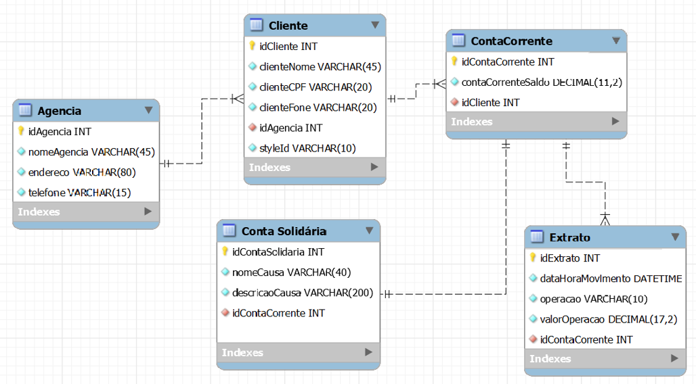

## 4Bank - API Spring-Java
### Frontend que consume esta API: <b><a href="https://github.com/ManoelPradoMark22/java-spring-front-4bank">Frontend Javascript</a></b>

---

#### Baixe o <b><a href="https://github.com/ManoelPradoMark22/ContaBancaria-JavaSpringApp/blob/master/JAVA-spring%20-%20Banco%20-%20postmanfile">ARQUIVO POSTMAN</a></b> para testar as rotas.
#### Crie um schema no MySQL Workbench chamado banco e verifique se suas credenciais estão de acordo no <b><a href="https://github.com/ManoelPradoMark22/ContaBancaria-JavaSpringApp/blob/master/src/main/resources/application.properties">application.properties</a></b>
#### Ao clonar o repositório, não esqueça de rodar o Maeven Update no projeto SpringBoot

---

### Requisitos - Deve ser possível...

- [x] ...criar/Listar Agência
- [x] ...criar/Listar Cliente
- [x] ...pesquisar Cliente por CPF
- [x] ...pesquisar Conta Corrente por CPF
- [x] ...cadastrar/Listar Conta Solidária
- [x] ...obter balanço geral do cliente (todas as contas do cliente)
- [x] ...obter balanço de cada conta do cliente
- [x] ...sacar
- [x] ...depositar
- [x] ...transferir
- [x] ...filtrar contas por CPF
- [x] ...gerar extratos por operação
- [x] ...listar extratos por cliente

---

## Regras de negócio - Não deve ser possível...

- [x] ...cadastrar um cliente com o mesmo CPF
- [x] ...cadastrar um cliente em uma agência inexistente
- [x] ...cadastrar uma conta em um cliente inexistente
- [x] ...cadastrar uma ContaSolidária de uma conta inexistente
- [x] ...transferir/depositar/sacar para uma conta inexistente 
- [x] ...sacar/transferir com saldo insuficiente
- [x] ...ter uma conta duplicada em ContasSolidárias
- [x] ...cadastrar um cliente com cpf inválido

---

---

### Equipe:

<b>Manoel Prado</b>
 

 

<b>Magdieline Sander</b>
 

 

<b>Marco Tulio</b>
 

 

<b>Luna Maria</b>
 

 

